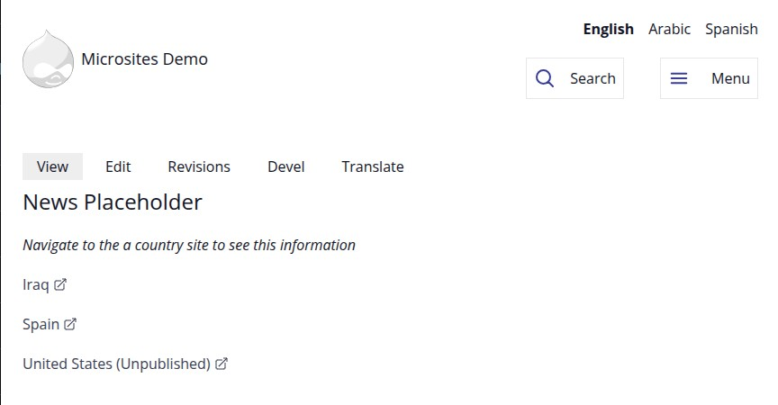
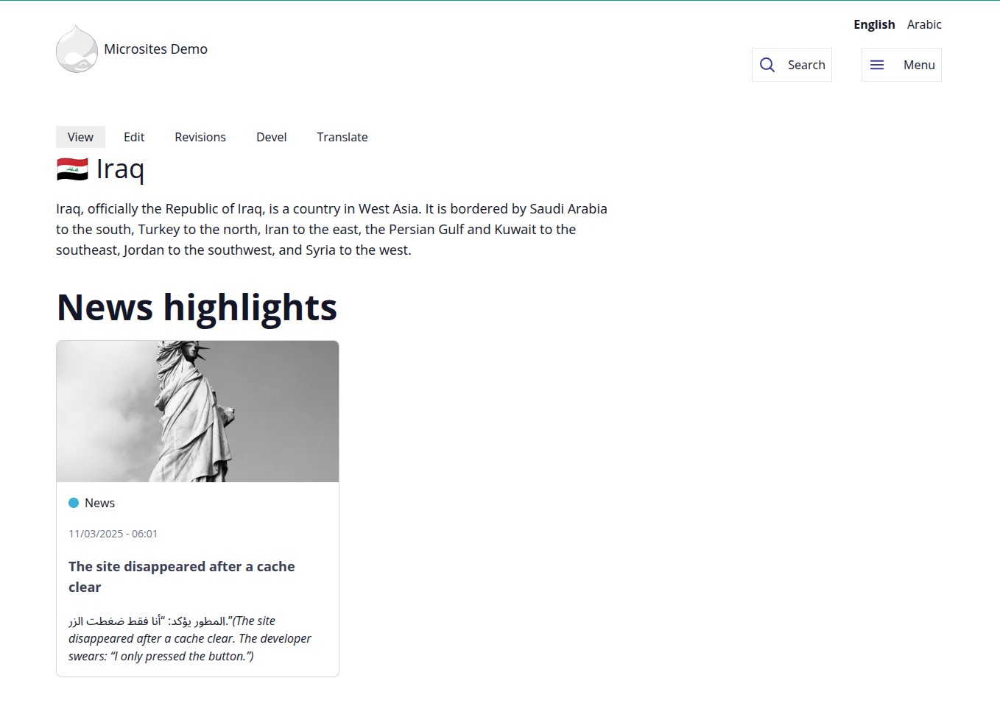
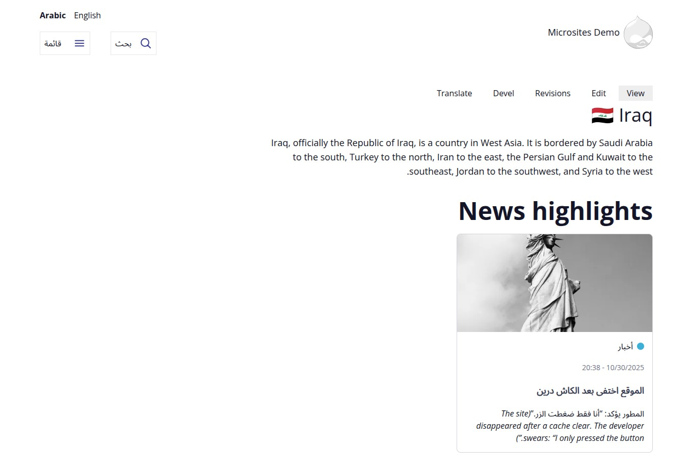
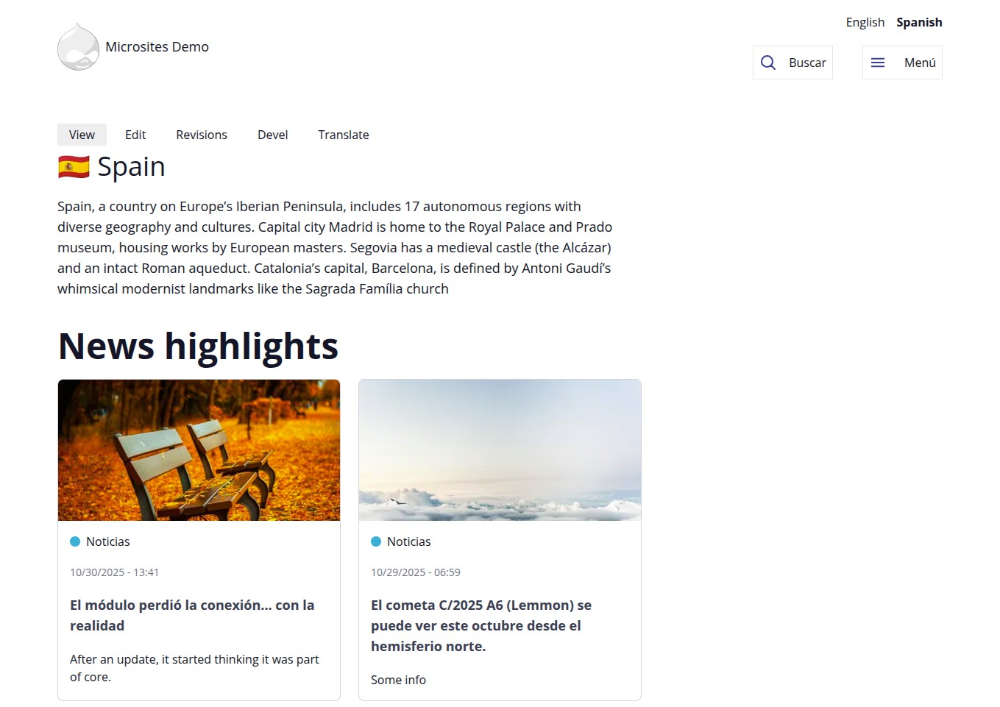
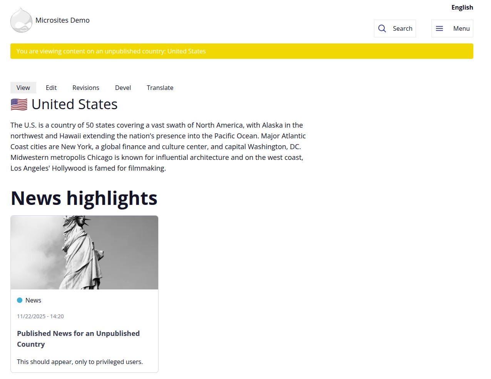
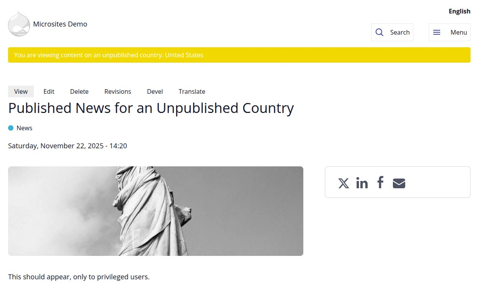
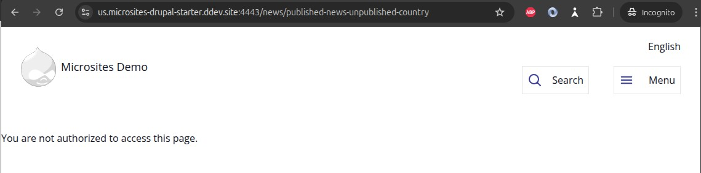
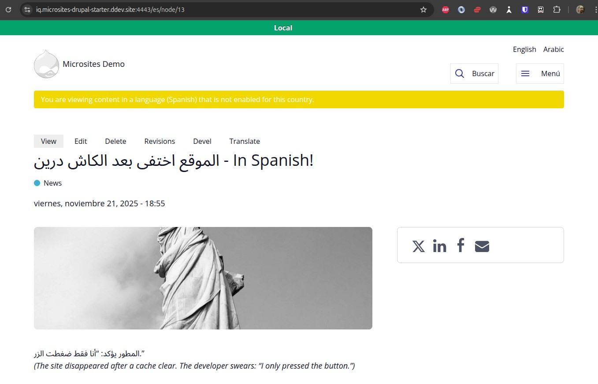
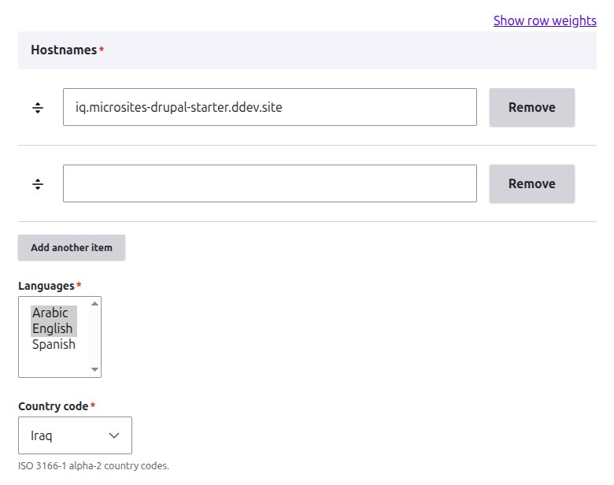

<style>
.slide-caption { font-size: 0.8em; margin: 0 0 0.4em; line-height: 1.3; }
.slide-url { font-size: 0.65em; margin: 0 0 0.6em; color: #5b87ff; word-break: break-word; }
</style>

<div class="slide-url">https://microsites-drupal-starter.ddev.site:4443/</div>



---

<div class="slide-caption">Different Microsites have their own hostname.</div>

<div class="slide-url">https://iq.microsites-drupal-starter.ddev.site:4443/</div>



---

<div class="slide-caption">Different Microsites have their own languages defined.</div>

<div class="slide-url">https://iq.microsites-drupal-starter.ddev.site:4443/ar</div>



---

<div class="slide-caption">Spain has English and Spanish, Arabic is not supported for this Microsite.</div>

<div class="slide-url">https://es.microsites-drupal-starter.ddev.site:4443/</div>


---

<div class="slide-url">https://es.microsites-drupal-starter.ddev.site:4443/es</div>



---

<div class="slide-caption">Unpublished Microsites are accessible only for privileged users.</div>

<div class="slide-url">https://us.microsites-drupal-starter.ddev.site:4443/</div>



---

<div class="slide-caption">The News node is published, but since it belongs to an unpublished Microsite, it's accessible only for privileged users.</div>

<div class="slide-url">https://us.microsites-drupal-starter.ddev.site:4443/news/published-news-unpublished-country</div>



---

<div class="slide-caption">Anonymous user can't access the News node since the Microsite is unpublished.</div>

<div class="slide-url">https://us.microsites-drupal-starter.ddev.site:4443/news/published-news-unpublished-country</div>



---

<div class="slide-caption">We also have the concept of disabled languages per Microsite. Allowing admins to still work on a new language before making it public.</div>

<div class="slide-url">https://iq.microsites-drupal-starter.ddev.site:4443/es/node/13</div>



---

<div class="slide-caption">The Country node is an Organic Group. Here we control the settings.</div>

<div class="slide-url">https://iq.microsites-drupal-starter.ddev.site:4443/node/2/edit</div>



---

## First we start with the access

```php
/**
 * Implements hook_node_access().
 */
function server_general_node_access(NodeInterface $entity, string $op, AccountInterface $account) {
  $country_result = _server_general_node_access_country_hostname($entity, $op, $account);
  if (!$country_result->isNeutral()) {
    return $country_result;
  }

  // ...

}
```

---

```php
function _server_general_node_access_country_hostname(NodeInterface $entity, string $op, AccountInterface $account): AccessResultInterface {
  if ($op !== 'view' || $entity->bundle() !== 'country' || $entity->isPublished()) {
    return AccessResult::neutral();
  }

  /** @var \Drupal\og\OgContextInterface $og_context */
  $og_context = \Drupal::service('og.context');
  $current_group = $og_context->getGroup();
  if (!$current_group instanceof NodeInterface || $current_group->id() !== $entity->id()) {
    return AccessResult::neutral();
  }

  /** @var \Drupal\og\MembershipManagerInterface $membership_manager */
  $membership_manager = \Drupal::service('og.membership_manager');
  if (!$membership_manager->isMember($entity, $account->id())) {
    return AccessResult::neutral();
  }

  return AccessResult::allowed()
    ->addCacheableDependency($entity)
    ->addCacheContexts(['url.site', 'og_membership_state'])
    ->addCacheTags(['og_membership_list']);
}
```

---

```php
#[OgGroupResolver(
  id: 'country_hostname',
  label: new TranslatableMarkup('Country from hostname'),
  description: new TranslatableMarkup('Resolves the Country group based on the current hostname.')
)]
class Country extends OgRouteGroupResolverBase {
```

---

```php
public function resolve(OgResolvedGroupCollectionInterface $collection) {
  // ...
  // Get the current hostname from the request.
  $hostname = $request->getHost();


  // ...
  // Query Country nodes that have the current hostname in field_hostnames.
  $query = $storage->getQuery()
    ->condition('type', 'country')
    ->condition('field_hostnames', $hostname)
    ->accessCheck(FALSE)
    ->range(0, 1);


  // ...
  // Verify it's actually a group.
  if ($this->groupTypeManager->isGroup($country->getEntityTypeId(), $country->bundle())) {
    // Add the group with the 'url.site' cache context since it depends on
    // the hostname.
    $collection->addGroup($country, ['url.site']);

    // Since we found a specific Country based on the hostname, we can be
    // certain this is the correct group context and stop propagation.
    $this->stopPropagation();
  }
}
```

---


```yaml
# og.settings.yml

# ...
group_resolvers:
  - route_group
  - route_group_content
  - country_hostname
```