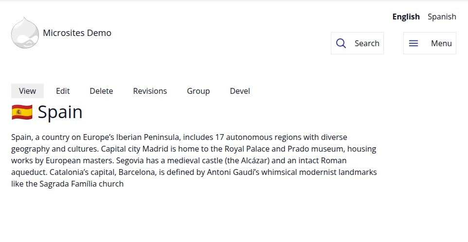
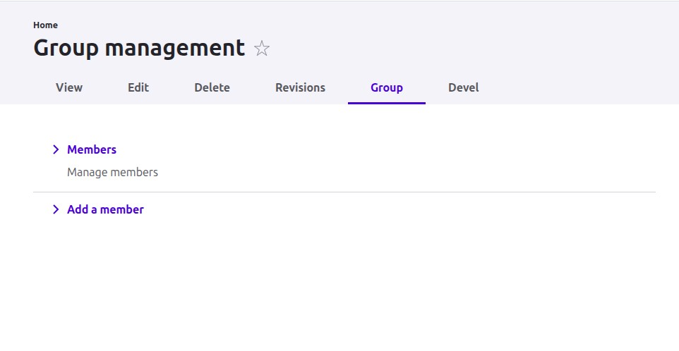
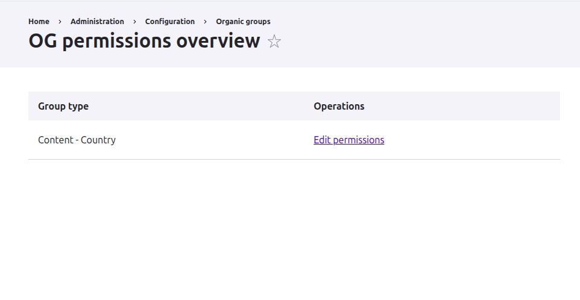
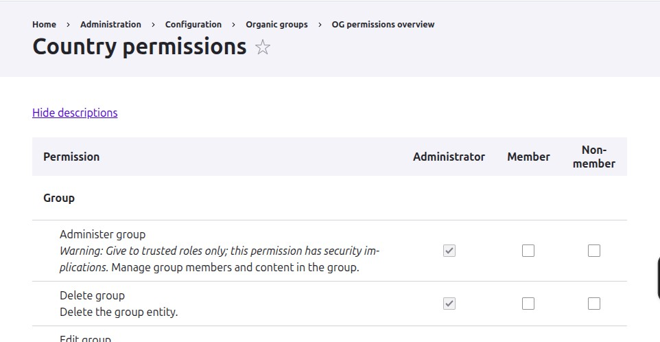

https://microsites-drupal-starter.ddev.site:4443/

---

Different Microsites have their own hostname.

https://iq.microsites-drupal-starter.ddev.site:4443/

---

Different Microsites have their own languages defined.

https://iq.microsites-drupal-starter.ddev.site:4443/ar

---

Spain has English and Spanish, Arabic is not supported for this Microsite.

https://es.microsites-drupal-starter.ddev.site:4443/

---

https://es.microsites-drupal-starter.ddev.site:4443/es

---

Unpublished Microsites are accessible only for privileged users.

https://us.microsites-drupal-starter.ddev.site:4443/

---

The News node is published, but since it belongs to an unpublished Microsite, it's accessible only for privileged users.

https://us.microsites-drupal-starter.ddev.site:4443/news/published-news-unpublished-country

---

Anonymous user can't access the News node since the Microsite is unpublished.

https://us.microsites-drupal-starter.ddev.site:4443/news/published-news-unpublished-country

---

We also have the concept of disabled languages per Microsite. Allowing admins to still work on a new language before making it public.

https://iq.microsites-drupal-starter.ddev.site:4443/es/node/13

---

The Country node is an Organic Group. Here we control the settings.

https://iq.microsites-drupal-starter.ddev.site:4443/node/2/edit

---

<pre><code data-trim class="language-php" data-line-numbers>
#[OgGroupResolver(
  id: 'country_hostname',
  label: new TranslatableMarkup('Country from hostname'),
  description: new TranslatableMarkup('Resolves the Country group based on the current hostname.')
)]
class Country extends OgRouteGroupResolverBase {
</code></pre>

---

<pre><code data-trim class="language-php" data-line-numbers="1-4|8-13|17-26">
public function resolve(OgResolvedGroupCollectionInterface $collection) {
  // ...
  // Get the current hostname from the request.
  $hostname = $request->getHost();

  // ...
  // Query Country nodes that have the current hostname in field_hostnames.
  $query = $storage->getQuery()
    ->condition('type', 'country')
    ->condition('field_hostnames', $hostname)
    ->accessCheck(FALSE)
    ->range(0, 1);

  // ...
  // Verify it's actually a group.
  $country = $storage->load($nid);
  if ($this->groupTypeManager->isGroup($country->getEntityTypeId(), $country->bundle())) {
    // Add the group with the 'url.site' cache context since it depends on
    // the hostname.
    $collection->addGroup($country, ['url.site']);

    // Since we found a specific Country based on the hostname, we can be
    // certain this is the correct group context and stop propagation.
    $this->stopPropagation();
  }
}
</code></pre>

---

<pre><code data-trim class="language-yaml" data-line-numbers="1-7|7">
# og.settings.yml

# ...
group_resolvers:
  - route_group
  - route_group_content
  - country_hostname
</code></pre>

<pre><code data-trim class="language-php" data-line-numbers>
/**
 * Implements hook_node_access().
 */
function server_general_node_access(NodeInterface $entity, string $op, AccountInterface $account) {
  $country_result = _server_general_node_access_country_hostname($entity, $op, $account);
  if (!$country_result->isNeutral()) {
    return $country_result;
  }

  // ...

}
</code></pre>

---

<pre><code data-trim class="language-php" data-line-numbers="1|3-6|8-12|14-17">
function _server_general_node_access_country_hostname(NodeInterface $entity, string $op, AccountInterface $account): AccessResultInterface {

  // Get the current Organic Group context.
  $og_context = \Drupal::service('og.context');
  $current_group = $og_context->getGroup();
  // ...

  // Check if the user is a member of the current Country group.
  $membership_manager = \Drupal::service('og.membership_manager');
  if (!$membership_manager->isMember($entity, $account->id())) {
    return AccessResult::neutral();
  }

  return AccessResult::allowed()
    ->addCacheableDependency($entity)
    ->addCacheContexts(['url.site', 'og_membership_state'])
    ->addCacheTags(['og_membership_list']);
}
</code></pre>

---

<pre><code data-trim class="language-php" data-line-numbers="5-10|16-22|24-28|30-33|35-38|40-46|48-53|54-56">
final class CountryGroupAccessRouteSubscriber extends RouteSubscriberBase {

  // ...

  protected function alterRoutes(RouteCollection $collection) {
    // Add custom access check to node routes.
    foreach (self::NODE_ROUTES as $route_name) {
      if ($route = $collection->get($route_name)) {
        $route->setRequirement('_custom_access', 'server_general.country_group_access_route_subscriber::access');
      }
    }
  }

  public function access(AccountInterface $account, NodeInterface $node): AccessResultInterface {
    $allowed_access = AccessResult::allowed()
      ->addCacheContexts(['url.site', 'languages:language_interface']);

    if ($this->adminContext->isAdminRoute()) {
      // Skip access checks for admin routes.
      return $allowed_access;
    }

    $country = $this->ogContext->getGroup();
    // No country context resolved.
    if (empty($country) || !$country instanceof NodeInterface) {
      return $allowed_access;
    }

    $country_access = $country->access('view', $account, TRUE);
    if (!$country_access->isAllowed()) {
      return $country_access;
    }

    $language_access = $this->checkLanguageAccess($node, $country, $account);
    if ($language_access->isForbidden()) {
      return $language_access;
    }

    if ($country->id() !== $node->id()) {
      // Check if the user has access to the node itself.
      $node_access = $node->access('view', $account, TRUE);
      if (!$node_access->isAllowed()) {
        return $node_access;
      }
    }

    if (!$country->isPublished()) {
      $this->messenger->addWarning($this->t('You are viewing content on an unpublished country: @title', [
        '@title' => $country->label(),
      ]));
    }

    $this->redirectToCorrectHostname($country);
    return $allowed_access;
  }
  </code></pre>

---

---

---

---

---

